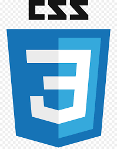

### Je suis Emmanuel , j'habite a La Réunion , 
🔭je suis Passionné par le monde numérique qui ne cesse d'évoluer, 
je souhaiterai m'investir dans ce domaine de l'informatique et du web, 
des application mobile et du desckopt qui me passionne tant.

😄😄😄😄J'ai des passions tel le manga, les jeux video, le modelisme, le cinema, la photographie, le dessin ...⚡

### Mes reseaux 💬 

### Langages et outils :

Les langages

<table>
  <tr>
    <td></td>
    <td></td>
     <td></td>
  </tr>
</table>
 
<table>
  <tr>
    <td></td>
    <td></td>
     <td></td>
    <td></td> 
  </tr>
</table>
 
 
 Les frameworks
<table>
  <tr>
    <td></td>
    <td></td>
    <td></td>
    <td></td>
  </tr>
</table>
 

 les Styles
 <table>
  <tr>
     <td></td>
    <td></td>
    <td></td>
  </tr>
 </table>
 
Les cms 
 </tr
</table>
<table>
  <tr>
    <td></td>
    <td></td>
  </tr>
</table>
 
Les mobiles
<table>
  <tr>
    <td></td>
  </tr>
</table>
 

    
 Les outils 
 <table>
  <tr>
    <td></td>
    <td></td>
    <td></td>
    <td></td>
  </tr>
  </table>
 
   <table>
  <tr>
    <td></td>
    <td></td></td>
    <td></td>
   </tr>
  </table>
  
 <table>
  <tr>
    <td></td>
    <td></td>
    <td></td>
    <td></td>
  </tr>
 </table>
 

<!--
**Noel974/Noel974** is a ✨ _special_ ✨ repository because its `README.md` (this file) appears on your GitHub profile.

Here are some ideas to get you started:

- 🔭 I’m currently working on ...
- 🌱 I’m currently learning ...
- 👯 I’m looking to collaborate on ...
- 🤔 I’m looking for help with ...
- 💬 Ask me about ...
- 📫 How to reach me: ...
- 😄 Pronouns: ...
- ⚡ Fun fact: ...
-->
